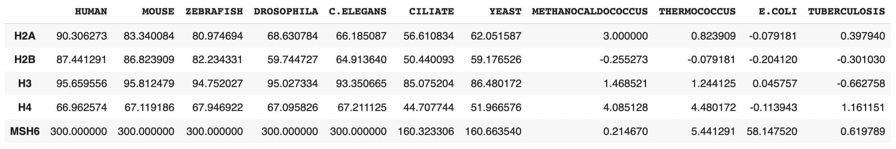

# Проект по биоинформатике. Индивидуальная часть

Гистоновая метка: **H3K36me**

Выбранный белок: **MSH6**

## Описание белка

Ген **MSH6** дает инструкции для производства белков, ключевых для восстановления ДНК. Мутации в нем связаны с синдромом Линча, который значительно увеличивает риски многих типов рака.

### Связь с H3K36me

В [этой статье](https://www.ncbi.nlm.nih.gov/pmc/articles/PMC3641580/) есть доказательства того, что белок MSH6 действительно связан с указанной гистоновой меткой: 

`
The hMSH6 PWWP domain interacts with H3K36me3 and is essential for hMutSα binding to chromatin
`

Он выполняет функцию Histone modification read

### Экспрессия

### Домены

## Выравнивание гистонов

Выравнивания произведены с помощью программы MEGA X

### H2A

Большая часть представленных последовательностей очень похожи между собой, поэтому можно считать, что они кодируют один и тот же ген. Остальные же различаются. Возможно, это связано с тем, что они похожи между собой по пространственному строению и выполняют одинаковые функции, но последовательности различаются. 
### H2B

Аналогично предыдущему гистону, большая часть представленных последовательностей очень похожи между собой, поэтому можно считать, что они кодируют один и тот же ген. Остальные же различаются. Возможно, это связано с тем, что они похожи между собой по пространственному строению и выполняют одинаковые функции, но последовательности различаются.
### H3

Все последовательности очень похожи между собой, поэтому можно считать, что они кодируют один и тот же ген. 
### H4

Все последовательности очень похожи между собой, поэтому можно считать, что они кодируют один и тот же ген.

## Поиск по протеомам
Выбранные последовательности для каждого гистона я сохранила в соответствующие файлы (приведены в `data`)

Все сделала в колаб [ноутбуке](https://colab.research.google.com/drive/1RlszUkkeDJF3OvY7kI686xcdelX1kFOA?usp=sharing) 

## Итог

В рамках работы над проектом был проделан анализ белка MSH6, изучена его связь с гистоновой меткой H3K36me. Также методами сравнительной геномики была изучена ранняя эволюция белков H2A, H2B, H3, H4 и MSH6: были взяты протеомы различных организмов (многоклеточных позвоночных, многоклеточных беспозвоночных, одноклеточных эукариот, архей и бактерий), по которым проводился поиск указанных белков для определения их эволюционного пути. Для каждой пары белок-организм проводился поиск программой BLAST, на выходе которой брался лучший по E-value хит. Получили таблицу, в ячейках которой указан  `-log10(e-value)`:

По ней была построена такая тепловая карта:

Чем светлее клетка -- тем лучше является найденное попадание белка в организм. 
Из этого графика можем сделать вывод, что все исследуемые белки появились у одноклеточных эукариот и далее перешли к более сложным организмам. У архей и бактерий они найдены не были, за исключением белка MSH6 -- он прослеживается у кишечной палочки. 

